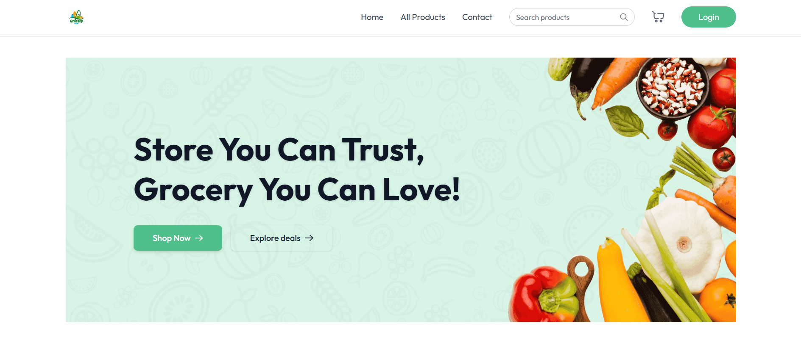
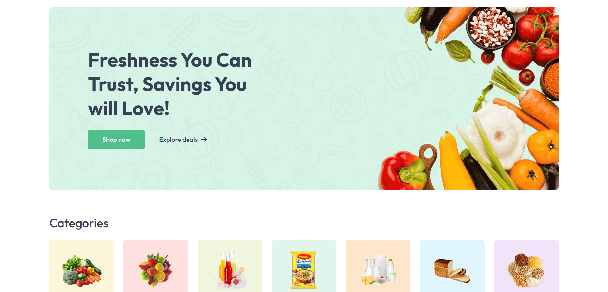
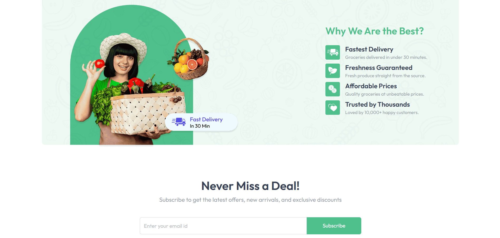
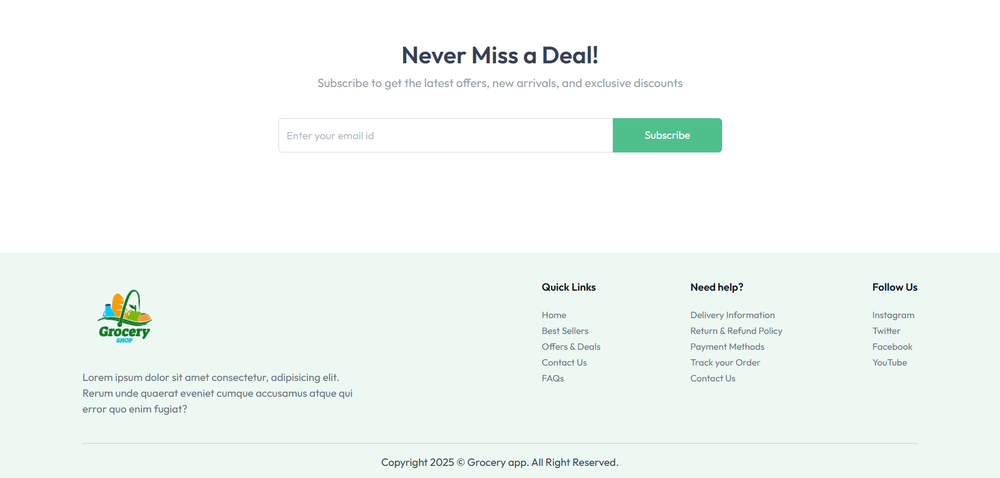
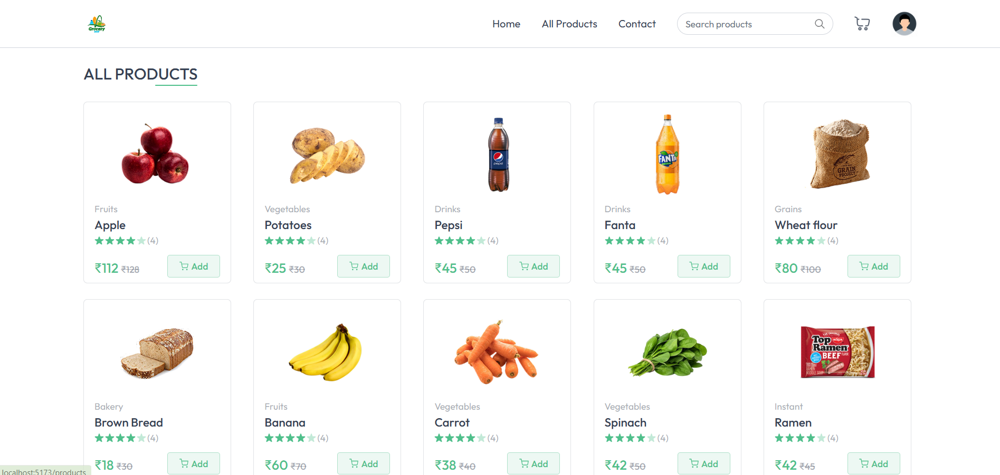
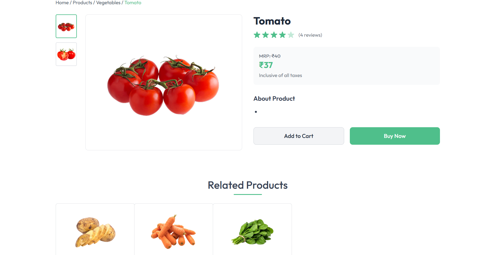
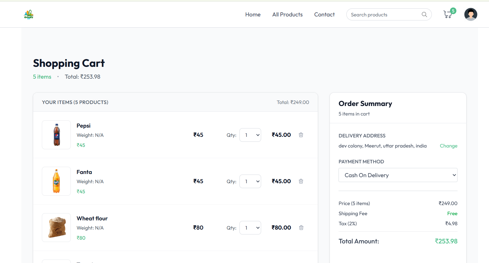
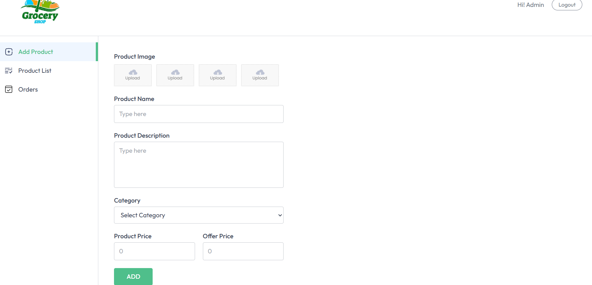
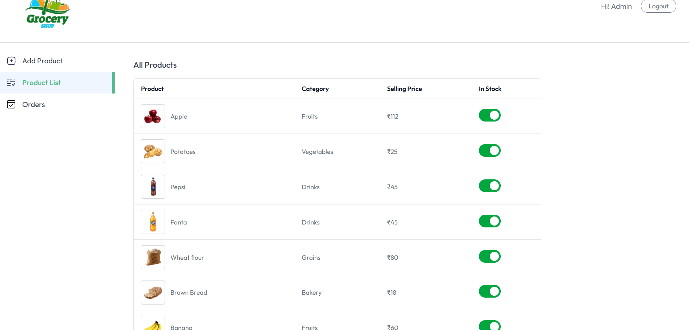

# Market-Basket - Grocery Shopping App

A full-stack grocery shopping application built with the MERN stack. This project demonstrates core concepts of full-stack development including authentication, CRUD operations, API integration, payment processing, and deployment.

---

## About The Project

Market-Basket is a production-ready grocery shopping web application that provides users with a seamless online shopping experience. From browsing products by categories to managing shopping carts and processing secure payments, the application delivers a complete e-commerce workflow.

**Key Highlights:**
- Full-stack implementation using MERN architecture
- Secure user authentication with JWT
- Real-time cart management with automatic price calculation
- Stripe payment gateway integration for secure checkout
- Responsive design optimized for both desktop and mobile devices

---

## Screenshots

### Home Page


### Category


### Best Seller


### Banner Section


### Footer


### All Products


### One Product


### Shopping Cart


### Admin


### Products List Admin Side


---

## Features

### User Features
- Browse grocery products organized by categories
- Add and remove items from shopping cart
- Update product quantities in real-time
- Automatic price calculation and total updates
- Secure payment processing with Stripe
- Place orders with a complete checkout flow
- View complete order history
- Responsive user interface for all screen sizes

### Payment Features
- Stripe payment gateway integration
- Secure card payment processing
- Test mode for development and testing
- Payment confirmation and order verification
- Automatic order status updates after successful payment

### Technical Features
- JWT-based authentication
- RESTful API architecture
- Database integration with MongoDB
- Environment-based configuration
- Cross-Origin Resource Sharing (CORS) enabled

---

## Technology Stack

### Frontend
- React.js
- React Router for navigation
- Axios for HTTP requests
- Bootstrap / Tailwind CSS for styling
- @stripe/stripe-js for payment processing

### Backend
- Node.js
- Express.js
- Stripe Node.js SDK

### Database
- MongoDB
- Mongoose ODM

### Payment Processing
- Stripe Payment Gateway
- Stripe Webhooks for event handling

---

## Prerequisites

Before you begin, ensure you have the following installed:
- Node.js (v16 or higher)
- npm or yarn package manager
- MongoDB Atlas account or local MongoDB installation
- Stripe account (for payment processing)

---

## Installation

### Clone the Repository
```bash
git clone https://github.com/shreyasingh-2004/Market-Basket.git
cd Market-Basket
Backend Setup
bash
cd server
npm install
cp .env.example .env
Configure your environment variables in .env:

env
PORT=5000
MONGODB_URI=your_mongodb_connection_string
JWT_SECRET=your_secret_key
STRIPE_SECRET_KEY=sk_test_your_stripe_secret_key
STRIPE_WEBHOOK_SECRET=whsec_your_webhook_secret
NODE_ENV=development
Start the backend server:

bash
npm run dev
Frontend Setup
Open a new terminal and navigate to the client directory:

bash
cd client
npm install
cp .env.example .env
Configure your environment variables in .env:

env
REACT_APP_API_URL=http://localhost:5000/api
REACT_APP_STRIPE_PUBLISHABLE_KEY=pk_test_your_stripe_publishable_key
Start the frontend development server:

bash
npm start
The application will be available at http://localhost:3000.

Payment Flow
User adds items to cart

User proceeds to checkout

Payment intent is created on the backend

Stripe Elements securely collect payment details

Payment confirmation and order placement

Order status updated in database

User receives confirmation

Project Structure
text
Market-Basket/
├── client/
│   ├── public/
│   └── src/
│       ├── components/
│       │   ├── CheckoutForm.js
│       │   └── PaymentSuccess.js
│       ├── pages/
│       ├── services/
│       └── utils/
├── server/
│   ├── src/
│   │   ├── controllers/
│   │   │   └── paymentController.js
│   │   ├── models/
│   │   ├── routes/
│   │   │   └── paymentRoutes.js
│   │   └── middleware/
│   └── config/
│       └── stripe.js
├── screenshots/
│   ├── home.png
│   ├── banner.png
│   ├── products.png
│   ├── cart.png
│   ├── checkout.png
│   ├── dashboard.png
│   └── mobile.png
└── README.md
Development Learnings
Building Market-Basket provided valuable insights into full-stack development:

Technical Skills
Full-stack architecture using MERN stack

REST API development and integration

State management in React applications

JWT-based authentication implementation

Database modeling with Mongoose

Stripe payment gateway integration

Webhook handling for payment events

Production Experience
Environment configuration management

Debugging production issues

Cross-origin resource sharing implementation

Responsive design principles

Secure payment processing implementation

Testing payment flows

Testing Payment Integration
Test Card Numbers
Success: 4242 4242 4242 4242

Requires Authentication: 4000 0025 0000 3155

Declined: 4000 0000 0000 0002
